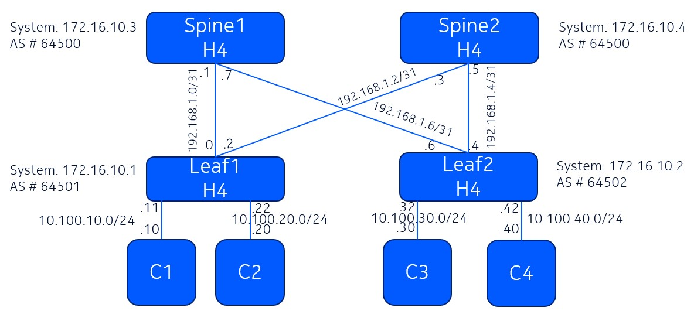

# Welcome to the SR Linux workshop at UW

This README is your starting point into the hands on section.

Pre-requisite: A laptop with SSH client and GitHub account (to use codespaces)

Shortcut links to major sections in this README:

|   |   |
|---|---|
| [Lab Topology](#lab-topology) | [Deploying the lab](#deploying-the-lab) |
| [SR Linux Commands](#sr-linux-configuration-mode) | [Configure Interfaces](#configure-interfaces) |
| [Default Network Instance](#default-network-instance) | [Static Routes](#static-routes) |
| [Routing Policy](#routing-policy) | [Configure BGP](#configure-bgp) |
| [BGP show commands](#bgp-show-commands) | |
| [ACL](#configuring-acl) | [gRPC](#grpc) |

## Lab Environment

---
<div align=center>
<a href="https://codespaces.new/sajusal/uw-workshop?quickstart=1">
</a>

**[Run](https://codespaces.new/sajusal/uw-workshop?quickstart=1) this lab in GitHub Codespaces for free**.  
[Learn more](https://containerlab.dev/manual/codespaces/) about Containerlab for Codespaces.

</div>

---

## Workshop
The objective of the hands on section of this workshop is the following:
- Configure a leaf-spine fabric
- Configure VRFs
- Establish communication between the clients

## Lab Topology



## Deploying the lab

Click on the Codespaces icon above to create codespace VM for your lab.

After codespace VM is created, the repo will be automatically cloned to the VM and you will be taken directly into the repo directory.

Verify that the git repo files are available on your codespaces VM.

```bash
@sajusal ➜ /workspaces/uw-workshop (main) $ 
@sajusal ➜ /workspaces/uw-workshop (main) $ ls -lrt
total 108
-rw-rw-rw- 1 vscode root  1923 Nov 15 03:03 srl-uw.clab.yml
-rw-rw-rw- 1 vscode root 97320 Nov 15 03:03 lab-topology.jpg
-rw-rw-rw- 1 vscode root  4451 Nov 15 03:03 README.md
```

To deploy the lab, run the following:

```bash
sudo clab deploy -t srl-uw.clab.yml
```

[Containerlab](https://containerlab.dev/) will deploy the lab and display a table with the list of nodes and their IPs.

```bash
INFO[0000] Containerlab v0.59.0 started                 
INFO[0000] Parsing & checking topology file: srl-uw.clab.yml 
INFO[0000] Creating docker network: Name="srl-uw-lab-mgmt", IPv4Subnet="172.20.20.0/24", IPv6Subnet="2001:172:20:20::/64", MTU=0 
INFO[0000] Pulling ghcr.io/nokia/srlinux:24.10.1 Docker image 
INFO[0046] Done pulling ghcr.io/nokia/srlinux:24.10.1   
INFO[0046] Pulling ghcr.io/srl-labs/alpine:latest Docker image 
INFO[0057] Done pulling ghcr.io/srl-labs/alpine:latest  
WARN[0057] Unable to init module loader: stat /lib/modules/6.5.0-1025-azure/modules.dep: no such file or directory. Skipping... 
INFO[0057] Creating lab directory: /workspaces/uw-workshop/clab-srl-uw 
INFO[0057] Creating container: "client3"                
INFO[0057] Creating container: "leaf1"                  
INFO[0057] Creating container: "leaf2"                  
INFO[0057] Creating container: "spine2"                 
INFO[0058] Creating container: "spine1"                 
INFO[0058] Created link: leaf2:e1-1 <--> spine2:e1-1    
INFO[0058] Running postdeploy actions for Nokia SR Linux 'leaf1' node 
INFO[0058] Created link: leaf1:e1-2 <--> spine2:e1-2    
INFO[0058] Running postdeploy actions for Nokia SR Linux 'spine2' node 
INFO[0058] Created link: client3:eth1 <--> leaf2:e1-10  
INFO[0058] Running postdeploy actions for Nokia SR Linux 'leaf2' node 
INFO[0059] Created link: leaf1:e1-1 <--> spine1:e1-1    
INFO[0059] Created link: leaf2:e1-2 <--> spine1:e1-2    
INFO[0059] Running postdeploy actions for Nokia SR Linux 'spine1' node 
INFO[0100] Creating container: "client4"                
INFO[0100] Creating container: "client2"                
INFO[0102] Created link: client4:eth1 <--> leaf2:e1-11  
INFO[0102] Created link: client2:eth1 <--> leaf1:e1-11  
INFO[0102] Creating container: "client1"                
INFO[0102] Created link: client1:eth1 <--> leaf1:e1-10  
INFO[0102] Executed command "ip address add 10.100.30.30/24 dev eth1" on the node "client3". stdout: 
INFO[0102] Executed command "ip route add 10.100.0.0/16 via 10.100.30.33" on the node "client3". stdout: 
INFO[0102] Executed command "ip address add 10.100.20.20/24 dev eth1" on the node "client2". stdout: 
INFO[0102] Executed command "ip route add 10.100.0.0/16 via 10.100.20.22" on the node "client2". stdout: 
INFO[0102] Executed command "ip address add 10.100.40.40/24 dev eth1" on the node "client4". stdout: 
INFO[0102] Executed command "ip route add 10.100.0.0/16 via 10.100.40.44" on the node "client4". stdout: 
INFO[0102] Executed command "ip address add 10.100.10.10/24 dev eth1" on the node "client1". stdout: 
INFO[0102] Executed command "ip route add 10.100.0.0/16 via 10.100.10.11" on the node "client1". stdout: 
INFO[0103] Adding containerlab host entries to /etc/hosts file 
INFO[0103] Adding ssh config for containerlab nodes     
+---+---------+--------------+-------------------------------+---------------+---------+-----------------+-----------------------+
| # |  Name   | Container ID |             Image             |     Kind      |  State  |  IPv4 Address   |     IPv6 Address      |
+---+---------+--------------+-------------------------------+---------------+---------+-----------------+-----------------------+
| 1 | client1 | dadda7f48ba6 | ghcr.io/srl-labs/alpine       | linux         | running | 172.20.20.10/24 | 2001:172:20:20::10/64 |
| 2 | client2 | 5cf1de11d58e | ghcr.io/srl-labs/alpine       | linux         | running | 172.20.20.11/24 | 2001:172:20:20::11/64 |
| 3 | client3 | 9af52f9cee96 | ghcr.io/srl-labs/alpine       | linux         | running | 172.20.20.12/24 | 2001:172:20:20::12/64 |
| 4 | client4 | 06024c15f773 | ghcr.io/srl-labs/alpine       | linux         | running | 172.20.20.13/24 | 2001:172:20:20::13/64 |
| 5 | leaf1   | ba8d59dd1da9 | ghcr.io/nokia/srlinux:24.10.1 | nokia_srlinux | running | 172.20.20.2/24  | 2001:172:20:20::2/64  |
| 6 | leaf2   | ff1fcbe8d76d | ghcr.io/nokia/srlinux:24.10.1 | nokia_srlinux | running | 172.20.20.3/24  | 2001:172:20:20::3/64  |
| 7 | spine1  | 5f46d377c142 | ghcr.io/nokia/srlinux:24.10.1 | nokia_srlinux | running | 172.20.20.4/24  | 2001:172:20:20::4/64  |
| 8 | spine2  | 8902e58577ab | ghcr.io/nokia/srlinux:24.10.1 | nokia_srlinux | running | 172.20.20.5/24  | 2001:172:20:20::5/64  |
+---+---------+--------------+-------------------------------+---------------+---------+-----------------+-----------------------+
```

To display all deployed labs on your VM at any time, use:

```bash
sudo clab inspect --all
```

## Connecting to the devices

Find the nodename or IP address of the device from the above output and then use SSH.

```bash
ssh leaf1
```

To login to the client, identify the client hostname using the `sudo clab inspect --all` command above and then:

```bash
sudo docker exec -it client1 bash
```

## SR Linux Configuration Mode

To enter candidate configuration edit mode in SR Linux, use:

```srl
enter candidate
```

To commit the configuration in SR Linux, use:

```srl
commit stay
```

Here's a reference table with some commonly used commands.

| Action | Command |
| --- | --- |
| Enter Candidate mode | `enter candidate {private}` |
| Commit configuration changes | `commit {now\|stay}` |
| | `now` – commits and exits from candidate mode |
| | `stay` – commits and stays in candidate mode |
| Delete configuration elements | `delete` |
| | Eg: `delete interface ethernet-1/5` |
| Discard configuration changes | `discard {now\|stay}` |
| Compare candidate to running | `diff running /` |
| View configuration in current mode & context | `info {flat}` |
| View configuration in another mode & context | `info {flat} from state /interface ethernet-1/1` |
| Output modifiers | `<command> \| as {table\|json\|yaml}` |
| Access Linux shell | `bash` |
| Find a command | `tree flat detail \| grep <keyword>` |

## Configure Interfaces

Interface configuration on Leaf1:

```srl
set / interface ethernet-1/1 admin-state enable
set / interface ethernet-1/1 vlan-tagging true
set / interface ethernet-1/1 description To-Spine1
set / interface ethernet-1/1 subinterface 0 type routed
set / interface ethernet-1/1 subinterface 0 ipv4 admin-state enable
set / interface ethernet-1/1 subinterface 0 ipv4 address 192.168.1.0/31
set / interface ethernet-1/1 subinterface 0 ipv6 admin-state enable
set / interface ethernet-1/1 subinterface 0 ipv6 router-advertisement router-role admin-state enable
set / interface ethernet-1/1 subinterface 0 vlan encap single-tagged vlan-id 1
set / interface ethernet-1/2 admin-state enable
set / interface ethernet-1/2 vlan-tagging true
set / interface ethernet-1/2 description To-Spine2
set / interface ethernet-1/2 subinterface 0 ipv4 admin-state enable
set / interface ethernet-1/2 subinterface 0 ipv4 address 192.168.1.2/31
set / interface ethernet-1/2 subinterface 0 ipv6 admin-state enable
set / interface ethernet-1/2 subinterface 0 ipv6 router-advertisement router-role admin-state enable
set / interface ethernet-1/2 subinterface 0 vlan encap single-tagged vlan-id 1
set / interface ethernet-1/10 description Client-1-1
set / interface ethernet-1/10 admin-state enable
set / interface ethernet-1/10 ethernet port-speed 40G
set / interface ethernet-1/10 subinterface 0 type routed
set / interface ethernet-1/10 subinterface 0 ipv4 admin-state enable
set / interface ethernet-1/10 subinterface 0 ipv4 address 10.100.10.11/24
set / interface ethernet-1/10 subinterface 0 ipv4 arp host-route populate dynamic datapath-programming true
set / interface ethernet-1/10 subinterface 0 ipv6 admin-state enable
set / interface ethernet-1/11 description Client-1-2
set / interface ethernet-1/11 admin-state enable
set / interface ethernet-1/11 ethernet port-speed 40G
set / interface ethernet-1/11 subinterface 0 type routed
set / interface ethernet-1/11 subinterface 0 ipv4 admin-state enable
set / interface ethernet-1/11 subinterface 0 ipv4 address 10.100.20.22/24
set / interface ethernet-1/11 subinterface 0 ipv4 arp host-route populate dynamic datapath-programming true
set / interface ethernet-1/11 subinterface 0 ipv6 admin-state enable
set / interface ethernet-1/12 subinterface 0 ipv6 admin-state enable
set / interface lo0 admin-state enable
set / interface lo0 subinterface 0 ipv4 admin-state enable
set / interface lo0 subinterface 0 ipv4 address 1.1.1.1/32
set / interface lo0 subinterface 0 ipv6 admin-state enable
set / interface lo0 subinterface 0 ipv6 address 1::/128
set / interface system0 description system
set / interface system0 admin-state enable
set / interface system0 subinterface 0 ipv4 admin-state enable
set / interface system0 subinterface 0 ipv4 address 172.16.10.1/32
```

Interface configuration on Leaf2:

```srl
set / interface ethernet-1/1 admin-state enable
set / interface ethernet-1/1 vlan-tagging true
set / interface ethernet-1/1 description To-Spine2
set / interface ethernet-1/1 subinterface 0 ipv4 admin-state enable
set / interface ethernet-1/1 subinterface 0 ipv4 address 192.168.1.4/31
set / interface ethernet-1/1 subinterface 0 ipv6 admin-state enable
set / interface ethernet-1/1 subinterface 0 ipv6 router-advertisement router-role admin-state enable
set / interface ethernet-1/1 subinterface 0 vlan encap single-tagged vlan-id 1
set / interface ethernet-1/2 admin-state enable
set / interface ethernet-1/2 vlan-tagging true
set / interface ethernet-1/2 description To-Spine1
set / interface ethernet-1/2 subinterface 0 ipv4 admin-state enable
set / interface ethernet-1/2 subinterface 0 ipv4 address 192.168.1.6/31
set / interface ethernet-1/2 subinterface 0 ipv6 admin-state enable
set / interface ethernet-1/2 subinterface 0 ipv6 router-advertisement router-role admin-state enable
set / interface ethernet-1/2 subinterface 0 vlan encap single-tagged vlan-id 1
set / interface ethernet-1/10 description Client-2-1
set / interface ethernet-1/10 admin-state enable
set / interface ethernet-1/10 ethernet port-speed 40G
set / interface ethernet-1/10 subinterface 0 type routed
set / interface ethernet-1/10 subinterface 0 ipv4 admin-state enable
set / interface ethernet-1/10 subinterface 0 ipv4 address 10.100.30.33/24
set / interface ethernet-1/10 subinterface 0 ipv4 arp host-route populate dynamic datapath-programming true
set / interface ethernet-1/11 description Client-2-2
set / interface ethernet-1/11 admin-state enable
set / interface ethernet-1/11 ethernet port-speed 40G
set / interface ethernet-1/11 subinterface 0 type routed
set / interface ethernet-1/11 subinterface 0 ipv4 admin-state enable
set / interface ethernet-1/11 subinterface 0 ipv4 address 10.100.40.44/24
set / interface ethernet-1/11 subinterface 0 ipv4 arp host-route populate dynamic datapath-programming true
set / interface system0 description system
set / interface system0 admin-state enable
set / interface system0 subinterface 0 ipv4 admin-state enable
set / interface system0 subinterface 0 ipv4 address 172.16.10.2/32
```

Interface configuration on spine1:

```srl
set / interface ethernet-1/1 admin-state enable
set / interface ethernet-1/1 vlan-tagging true
set / interface ethernet-1/1 description To-Leaf1
set / interface ethernet-1/1 subinterface 0 ipv4 admin-state enable
set / interface ethernet-1/1 subinterface 0 ipv4 address 192.168.1.1/31
set / interface ethernet-1/1 subinterface 0 ipv6 admin-state enable
set / interface ethernet-1/1 subinterface 0 ipv6 router-advertisement router-role admin-state enable
set / interface ethernet-1/1 subinterface 0 vlan encap single-tagged vlan-id 1
set / interface ethernet-1/2 admin-state enable
set / interface ethernet-1/2 vlan-tagging true
set / interface ethernet-1/2 description To-Leaf2
set / interface ethernet-1/2 subinterface 0 ipv4 admin-state enable
set / interface ethernet-1/2 subinterface 0 ipv4 address 192.168.1.7/31
set / interface ethernet-1/2 subinterface 0 ipv6 admin-state enable
set / interface ethernet-1/2 subinterface 0 ipv6 router-advertisement router-role admin-state enable
set / interface ethernet-1/2 subinterface 0 vlan encap single-tagged vlan-id 1
set / interface system0 description system
set / interface system0 admin-state enable
set / interface system0 subinterface 0 ipv4 admin-state enable
set / interface system0 subinterface 0 ipv4 address 172.16.10.3/32
```

Interface configuration on spine2:

```srl
set / interface ethernet-1/1 admin-state enable
set / interface ethernet-1/1 vlan-tagging true
set / interface ethernet-1/1 description To-Leaf2
set / interface ethernet-1/1 subinterface 0 ipv4 admin-state enable
set / interface ethernet-1/1 subinterface 0 ipv4 address 192.168.1.5/31
set / interface ethernet-1/1 subinterface 0 ipv6 admin-state enable
set / interface ethernet-1/1 subinterface 0 ipv6 router-advertisement router-role admin-state enable
set / interface ethernet-1/1 subinterface 0 vlan encap single-tagged vlan-id 1
set / interface ethernet-1/2 admin-state enable
set / interface ethernet-1/2 vlan-tagging true
set / interface ethernet-1/2 description To-Leaf1
set / interface ethernet-1/2 subinterface 0 ipv4 admin-state enable
set / interface ethernet-1/2 subinterface 0 ipv4 address 192.168.1.3/31
set / interface ethernet-1/2 subinterface 0 ipv6 admin-state enable
set / interface ethernet-1/2 subinterface 0 ipv6 router-advertisement router-role admin-state enable
set / interface ethernet-1/2 subinterface 0 vlan encap single-tagged vlan-id 1
set / interface lo0 admin-state enable
set / interface lo0 subinterface 0 ipv4 admin-state enable
set / interface lo0 subinterface 0 ipv4 address 11.11.11.11/32
set / interface system0 description system
set / interface system0 admin-state enable
set / interface system0 subinterface 0 ipv4 admin-state enable
set / interface system0 subinterface 0 ipv4 address 172.16.10.4/32
```

## Default Network Instance

Network instance configuration on leaf1 and leaf2:

```srl
set / network-instance default type default
set / network-instance default admin-state enable
set / network-instance default description "Default network instance"
set / network-instance default ip-forwarding receive-ipv4-check false
set / network-instance default inter-instance-policies apply-policy import-policy import-all
set / network-instance default inter-instance-policies apply-policy export-policy export-all
set / network-instance default interface ethernet-1/1.0
set / network-instance default interface ethernet-1/10.0
set / network-instance default interface ethernet-1/11.0
set / network-instance default interface ethernet-1/2.0
set / network-instance default interface system0.0
```

Network instance configuration on spine1 and spine2:

```srl
set / network-instance default type default
set / network-instance default admin-state enable
set / network-instance default description "Default network instance"
set / network-instance default ip-forwarding receive-ipv4-check false
set / network-instance default interface ethernet-1/1.0
set / network-instance default interface ethernet-1/2.0
set / network-instance default interface system0.0
```

## Static Routes

Objective is to ping between the lo0 loopback IPs on leaf1 and spine2.

Static route configuration on leaf1:

```srl
set / network-instance default interface lo0.0
set / network-instance default static-routes route 11.11.11.11/32 admin-state enable
set / network-instance default static-routes route 11.11.11.11/32 metric 1
set / network-instance default static-routes route 11.11.11.11/32 preference 10
set / network-instance default static-routes route 11.11.11.11/32 next-hop-group nhg-lb
set / network-instance default next-hop-groups group nhg-lb admin-state enable
set / network-instance default next-hop-groups group nhg-lb nexthop 1 ip-address 192.168.1.3
set / network-instance default next-hop-groups group nhg-lb nexthop 1 admin-state enable
set / network-instance default next-hop-groups group nhg-lb nexthop 1 resolve true
```

Static route configuration on spine2:

```srl
set / network-instance default interface lo0.0
set / network-instance default static-routes route 1.1.1.1/32 admin-state enable
set / network-instance default static-routes route 1.1.1.1/32 metric 1
set / network-instance default static-routes route 1.1.1.1/32 preference 10
set / network-instance default static-routes route 1.1.1.1/32 next-hop-group nhg-lb
set / network-instance default next-hop-groups group nhg-lb admin-state enable
set / network-instance default next-hop-groups group nhg-lb nexthop 1 ip-address 192.168.1.2
set / network-instance default next-hop-groups group nhg-lb nexthop 1 admin-state enable
set / network-instance default next-hop-groups group nhg-lb nexthop 1 resolve true
```

Ping spine2 loopback from leaf1:

```srl
ping 11.11.11.11 network-instance default
```

## Routing Policy

Routing policy configuration on all routers:

```srl
set / routing-policy policy export-all default-action policy-result accept
set / routing-policy policy export-to-underlay default-action policy-result reject
set / routing-policy policy export-to-underlay statement 10 match protocol local
set / routing-policy policy export-to-underlay statement 10 action policy-result accept
set / routing-policy policy export-to-underlay statement 10 action bgp local-preference set 100
set / routing-policy policy export-to-underlay statement 20 match protocol bgp
set / routing-policy policy export-to-underlay statement 20 action policy-result accept
set / routing-policy policy export-to-underlay statement 20 action bgp local-preference set 100
set / routing-policy policy export-to-underlay statement 30 match protocol aggregate
set / routing-policy policy export-to-underlay statement 30 action policy-result accept
set / routing-policy policy export-to-underlay statement 30 action bgp local-preference set 100
set / routing-policy policy export-to-underlay statement 40 match protocol host
set / routing-policy policy export-to-underlay statement 40 action policy-result accept
set / routing-policy policy export-to-underlay statement 40 action bgp local-preference set 100
set / routing-policy policy export-to-underlay statement 50 match protocol arp-nd
set / routing-policy policy export-to-underlay statement 50 action policy-result accept
set / routing-policy policy export-to-underlay statement 50 action bgp local-preference set 100
set / routing-policy policy export-to-underlay statement 60 match protocol static
set / routing-policy policy export-to-underlay statement 60 action policy-result accept
set / routing-policy policy export-to-underlay statement 60 action route-preference set 5
set / routing-policy policy import-all default-action policy-result accept
set / routing-policy policy import-from-underlay default-action policy-result reject
set / routing-policy policy import-from-underlay statement 20 match protocol bgp
set / routing-policy policy import-from-underlay statement 20 action policy-result accept
```

## Configure BGP

BGP configuration on leaf1:

```srl
set / network-instance default protocols bgp admin-state enable
set / network-instance default protocols bgp autonomous-system 64501
set / network-instance default protocols bgp router-id 172.16.10.1
set / network-instance default protocols bgp dynamic-neighbors interface ethernet-1/1.0 peer-group ebgp-underlay
set / network-instance default protocols bgp dynamic-neighbors interface ethernet-1/1.0 allowed-peer-as [ 64500..64505 ]
set / network-instance default protocols bgp dynamic-neighbors interface ethernet-1/2.0 peer-group ebgp-underlay
set / network-instance default protocols bgp dynamic-neighbors interface ethernet-1/2.0 allowed-peer-as [ 64500..64505 ]
set / network-instance default protocols bgp afi-safi evpn evpn rapid-update true
set / network-instance default protocols bgp afi-safi ipv4-unicast admin-state enable
set / network-instance default protocols bgp afi-safi ipv4-unicast multipath allow-multiple-as true
set / network-instance default protocols bgp afi-safi ipv4-unicast multipath maximum-paths 64
set / network-instance default protocols bgp afi-safi ipv4-unicast ipv4-unicast advertise-ipv6-next-hops true
set / network-instance default protocols bgp afi-safi ipv4-unicast ipv4-unicast receive-ipv6-next-hops true
set / network-instance default protocols bgp afi-safi ipv6-unicast admin-state enable
set / network-instance default protocols bgp afi-safi ipv6-unicast multipath allow-multiple-as true
set / network-instance default protocols bgp afi-safi ipv6-unicast multipath maximum-paths 64
set / network-instance default protocols bgp route-advertisement rapid-withdrawal true
set / network-instance default protocols bgp route-advertisement wait-for-fib-install true
set / network-instance default protocols bgp group ebgp-underlay admin-state enable
set / network-instance default protocols bgp group ebgp-underlay export-policy [ export-all ]
set / network-instance default protocols bgp group ebgp-underlay import-policy [ import-all ]
set / network-instance default protocols bgp group ebgp-underlay failure-detection enable-bfd true
set / network-instance default protocols bgp group ebgp-underlay failure-detection fast-failover true
set / network-instance default protocols bgp group ebgp-underlay afi-safi evpn admin-state disable
set / network-instance default protocols bgp group ebgp-underlay afi-safi ipv4-unicast admin-state enable
set / network-instance default protocols bgp group ebgp-underlay afi-safi ipv4-unicast add-paths receive true
set / network-instance default protocols bgp group ebgp-underlay afi-safi ipv4-unicast add-paths send true
set / network-instance default protocols bgp group ebgp-underlay afi-safi ipv4-unicast ipv4-unicast advertise-ipv6-next-hops true
set / network-instance default protocols bgp group ebgp-underlay afi-safi ipv4-unicast ipv4-unicast receive-ipv6-next-hops true
set / network-instance default protocols bgp group ebgp-underlay afi-safi ipv6-unicast admin-state enable
set / network-instance default protocols bgp group ebgp-underlay timers connect-retry 10
set / network-instance default protocols bgp group ebgp-underlay timers hold-time 3
set / network-instance default protocols bgp group ebgp-underlay timers keepalive-interval 1
set / network-instance default protocols bgp group ebgp-underlay timers minimum-advertisement-interval 1
set / network-instance default protocols bgp group ebgp-underlay transport passive-mode false
set / network-instance default protocols bgp neighbor 192.168.1.1 admin-state enable
set / network-instance default protocols bgp neighbor 192.168.1.1 peer-as 64500
set / network-instance default protocols bgp neighbor 192.168.1.1 peer-group ebgp-underlay
set / network-instance default protocols bgp neighbor 192.168.1.3 admin-state enable
set / network-instance default protocols bgp neighbor 192.168.1.3 peer-as 64500
set / network-instance default protocols bgp neighbor 192.168.1.3 peer-group ebgp-underlay
```

BGP configuration on leaf2:

```srl
set / network-instance default protocols bgp admin-state enable
set / network-instance default protocols bgp autonomous-system 64502
set / network-instance default protocols bgp router-id 172.16.10.2
set / network-instance default protocols bgp dynamic-neighbors interface ethernet-1/1.0 peer-group ebgp-underlay
set / network-instance default protocols bgp dynamic-neighbors interface ethernet-1/1.0 allowed-peer-as [ 64500..64505 ]
set / network-instance default protocols bgp dynamic-neighbors interface ethernet-1/2.0 peer-group ebgp-underlay
set / network-instance default protocols bgp dynamic-neighbors interface ethernet-1/2.0 allowed-peer-as [ 64500..64505 ]
set / network-instance default protocols bgp ebgp-default-policy import-reject-all false
set / network-instance default protocols bgp ebgp-default-policy export-reject-all false
set / network-instance default protocols bgp afi-safi evpn evpn rapid-update true
set / network-instance default protocols bgp afi-safi ipv4-unicast admin-state enable
set / network-instance default protocols bgp afi-safi ipv4-unicast multipath allow-multiple-as true
set / network-instance default protocols bgp afi-safi ipv4-unicast multipath maximum-paths 64
set / network-instance default protocols bgp afi-safi ipv4-unicast ipv4-unicast advertise-ipv6-next-hops true
set / network-instance default protocols bgp afi-safi ipv4-unicast ipv4-unicast receive-ipv6-next-hops true
set / network-instance default protocols bgp afi-safi ipv6-unicast admin-state enable
set / network-instance default protocols bgp afi-safi ipv6-unicast multipath allow-multiple-as true
set / network-instance default protocols bgp afi-safi ipv6-unicast multipath maximum-paths 64
set / network-instance default protocols bgp route-advertisement rapid-withdrawal true
set / network-instance default protocols bgp route-advertisement wait-for-fib-install true
set / network-instance default protocols bgp group ebgp-underlay admin-state enable
set / network-instance default protocols bgp group ebgp-underlay export-policy [ export-to-underlay ]
set / network-instance default protocols bgp group ebgp-underlay import-policy [ import-from-underlay ]
set / network-instance default protocols bgp group ebgp-underlay failure-detection enable-bfd true
set / network-instance default protocols bgp group ebgp-underlay failure-detection fast-failover true
set / network-instance default protocols bgp group ebgp-underlay afi-safi evpn admin-state disable
set / network-instance default protocols bgp group ebgp-underlay afi-safi ipv4-unicast admin-state enable
set / network-instance default protocols bgp group ebgp-underlay afi-safi ipv4-unicast ipv4-unicast advertise-ipv6-next-hops true
set / network-instance default protocols bgp group ebgp-underlay afi-safi ipv4-unicast ipv4-unicast receive-ipv6-next-hops true
set / network-instance default protocols bgp group ebgp-underlay afi-safi ipv6-unicast admin-state enable
set / network-instance default protocols bgp group ebgp-underlay timers connect-retry 10
set / network-instance default protocols bgp group ebgp-underlay timers hold-time 3
set / network-instance default protocols bgp group ebgp-underlay timers keepalive-interval 1
set / network-instance default protocols bgp group ebgp-underlay timers minimum-advertisement-interval 1
set / network-instance default protocols bgp group ebgp-underlay transport passive-mode false
set / network-instance default protocols bgp neighbor 192.168.1.5 admin-state enable
set / network-instance default protocols bgp neighbor 192.168.1.5 peer-as 64500
set / network-instance default protocols bgp neighbor 192.168.1.5 peer-group ebgp-underlay
set / network-instance default protocols bgp neighbor 192.168.1.7 admin-state enable
set / network-instance default protocols bgp neighbor 192.168.1.7 peer-as 64500
set / network-instance default protocols bgp neighbor 192.168.1.7 peer-group ebgp-underlay
```

BGP configuration on spine1:

```srl
set / network-instance default protocols bgp admin-state enable
set / network-instance default protocols bgp autonomous-system 64500
set / network-instance default protocols bgp router-id 172.16.10.3
set / network-instance default protocols bgp dynamic-neighbors interface ethernet-1/1.0 peer-group ebgp-underlay
set / network-instance default protocols bgp dynamic-neighbors interface ethernet-1/1.0 allowed-peer-as [ 64500..64505 ]
set / network-instance default protocols bgp dynamic-neighbors interface ethernet-1/2.0 peer-group ebgp-underlay
set / network-instance default protocols bgp dynamic-neighbors interface ethernet-1/2.0 allowed-peer-as [ 64500..64505 ]
set / network-instance default protocols bgp afi-safi evpn evpn rapid-update true
set / network-instance default protocols bgp afi-safi ipv4-unicast admin-state enable
set / network-instance default protocols bgp afi-safi ipv4-unicast multipath allow-multiple-as true
set / network-instance default protocols bgp afi-safi ipv4-unicast multipath maximum-paths 64
set / network-instance default protocols bgp afi-safi ipv4-unicast ipv4-unicast advertise-ipv6-next-hops true
set / network-instance default protocols bgp afi-safi ipv4-unicast ipv4-unicast receive-ipv6-next-hops true
set / network-instance default protocols bgp afi-safi ipv6-unicast admin-state enable
set / network-instance default protocols bgp afi-safi ipv6-unicast multipath allow-multiple-as true
set / network-instance default protocols bgp afi-safi ipv6-unicast multipath maximum-paths 64
set / network-instance default protocols bgp route-advertisement rapid-withdrawal true
set / network-instance default protocols bgp route-advertisement wait-for-fib-install true
set / network-instance default protocols bgp group ebgp-underlay admin-state enable
set / network-instance default protocols bgp group ebgp-underlay export-policy [ export-all ]
set / network-instance default protocols bgp group ebgp-underlay import-policy [ import-all ]
set / network-instance default protocols bgp group ebgp-underlay failure-detection enable-bfd true
set / network-instance default protocols bgp group ebgp-underlay failure-detection fast-failover true
set / network-instance default protocols bgp group ebgp-underlay afi-safi evpn admin-state disable
set / network-instance default protocols bgp group ebgp-underlay afi-safi ipv4-unicast admin-state enable
set / network-instance default protocols bgp group ebgp-underlay afi-safi ipv4-unicast ipv4-unicast advertise-ipv6-next-hops true
set / network-instance default protocols bgp group ebgp-underlay afi-safi ipv4-unicast ipv4-unicast receive-ipv6-next-hops true
set / network-instance default protocols bgp group ebgp-underlay afi-safi ipv6-unicast admin-state enable
set / network-instance default protocols bgp group ebgp-underlay timers connect-retry 10
set / network-instance default protocols bgp group ebgp-underlay timers hold-time 3
set / network-instance default protocols bgp group ebgp-underlay timers keepalive-interval 1
set / network-instance default protocols bgp group ebgp-underlay timers minimum-advertisement-interval 1
set / network-instance default protocols bgp group ebgp-underlay transport passive-mode false
set / network-instance default protocols bgp neighbor 192.168.1.0 admin-state enable
set / network-instance default protocols bgp neighbor 192.168.1.0 peer-as 64501
set / network-instance default protocols bgp neighbor 192.168.1.0 peer-group ebgp-underlay
set / network-instance default protocols bgp neighbor 192.168.1.6 admin-state enable
set / network-instance default protocols bgp neighbor 192.168.1.6 peer-as 64502
set / network-instance default protocols bgp neighbor 192.168.1.6 peer-group ebgp-underlay
```

BGP configuration on spine2:

```srl
set / network-instance default protocols bgp admin-state enable
set / network-instance default protocols bgp autonomous-system 64500
set / network-instance default protocols bgp router-id 172.16.10.4
set / network-instance default protocols bgp dynamic-neighbors interface ethernet-1/1.0 peer-group ebgp-underlay
set / network-instance default protocols bgp dynamic-neighbors interface ethernet-1/1.0 allowed-peer-as [ 64500..64505 ]
set / network-instance default protocols bgp dynamic-neighbors interface ethernet-1/2.0 peer-group ebgp-underlay
set / network-instance default protocols bgp dynamic-neighbors interface ethernet-1/2.0 allowed-peer-as [ 64500..64505 ]
set / network-instance default protocols bgp afi-safi evpn evpn rapid-update true
set / network-instance default protocols bgp afi-safi ipv4-unicast admin-state enable
set / network-instance default protocols bgp afi-safi ipv4-unicast multipath allow-multiple-as true
set / network-instance default protocols bgp afi-safi ipv4-unicast multipath maximum-paths 64
set / network-instance default protocols bgp afi-safi ipv4-unicast ipv4-unicast advertise-ipv6-next-hops true
set / network-instance default protocols bgp afi-safi ipv4-unicast ipv4-unicast receive-ipv6-next-hops true
set / network-instance default protocols bgp afi-safi ipv6-unicast admin-state enable
set / network-instance default protocols bgp afi-safi ipv6-unicast multipath allow-multiple-as true
set / network-instance default protocols bgp afi-safi ipv6-unicast multipath maximum-paths 64
set / network-instance default protocols bgp route-advertisement rapid-withdrawal true
set / network-instance default protocols bgp route-advertisement wait-for-fib-install true
set / network-instance default protocols bgp group ebgp-underlay admin-state enable
set / network-instance default protocols bgp group ebgp-underlay export-policy [ export-to-underlay ]
set / network-instance default protocols bgp group ebgp-underlay import-policy [ import-from-underlay ]
set / network-instance default protocols bgp group ebgp-underlay failure-detection enable-bfd true
set / network-instance default protocols bgp group ebgp-underlay failure-detection fast-failover true
set / network-instance default protocols bgp group ebgp-underlay afi-safi evpn admin-state disable
set / network-instance default protocols bgp group ebgp-underlay afi-safi ipv4-unicast admin-state enable
set / network-instance default protocols bgp group ebgp-underlay afi-safi ipv4-unicast ipv4-unicast advertise-ipv6-next-hops true
set / network-instance default protocols bgp group ebgp-underlay afi-safi ipv4-unicast ipv4-unicast receive-ipv6-next-hops true
set / network-instance default protocols bgp group ebgp-underlay afi-safi ipv6-unicast admin-state enable
set / network-instance default protocols bgp group ebgp-underlay timers connect-retry 10
set / network-instance default protocols bgp group ebgp-underlay timers hold-time 3
set / network-instance default protocols bgp group ebgp-underlay timers keepalive-interval 1
set / network-instance default protocols bgp group ebgp-underlay timers minimum-advertisement-interval 1
set / network-instance default protocols bgp group ebgp-underlay transport passive-mode false
set / network-instance default protocols bgp neighbor 192.168.1.2 admin-state enable
set / network-instance default protocols bgp neighbor 192.168.1.2 peer-as 64501
set / network-instance default protocols bgp neighbor 192.168.1.2 peer-group ebgp-underlay
set / network-instance default protocols bgp neighbor 192.168.1.4 admin-state enable
set / network-instance default protocols bgp neighbor 192.168.1.4 peer-as 64502
set / network-instance default protocols bgp neighbor 192.168.1.4 peer-group ebgp-underlay
```

## BGP Show Commands

To check the route-table for the default vrf:

```srl
show network-instance default route-table
```

To check BGP neighbor status:

```srl
show network-instance default protocols bgp neighbor
```

To check routes advertised to a BGP neighbor:

```srl
show network-instance default protocols bgp neighbor 192.168.1.3 advertised-routes ipv4
```

To check routes received from a BGP neighbor:

```srl
show network-instance default protocols bgp neighbor 192.168.1.3 received-routes ipv4
```

Now that we applied the above configs, we should be able to ping between the clients.

Login to client1 using:

```bash
docker exec -it client1 sh
```

Then ping the other clients

```bash
ping 10.100.30.30
```

## Configuring ACL

Example to block ICMP ping on leaf1 interface

```srl
set / acl acl-filter block_icmp type ipv4 statistics-per-entry true
set / acl acl-filter block_icmp type ipv4 entry 10 match ipv4 protocol icmp
set / acl acl-filter block_icmp type ipv4 entry 10 match ipv4 source-ip prefix 192.168.1.0/31
set / acl acl-filter block_icmp type ipv4 entry 10 action drop
```

Applying ACL under leaf1 interface:

```srl
set / acl interface ethernet-1/1.0 input acl-filter block_icmp type ipv4
```

Ping command:

```srl
ping 192.168.1.1 network-instance default
```

## gRPC

Refer to [gNMIc page](https://gnmic.openconfig.net/) for more details.

Install gNMI client:

```bash
bash -c "$(curl -sL https://get-gnmic.openconfig.net)"
```

Use client to connect to leaf1 and query gnmi capabilities:

```bash
gnmic -a leaf1:57401 -u admin -p password --insecure cap
```

Query interface stats:

```bash
gnmic -a leaf1:57401 -u admin -p password --insecure get --path /interface[name=ethernet-1/1]/statistics -e json_ietf
```

## Deploy lab with full config

To deploy the lab with the full config for this workshop:

```bash
cd config
sudo clab dep -t clab-uw-full-config.yml
```

This will deploy the lab with the full configuration for this workshop. After deployment, you may explore the lab.
